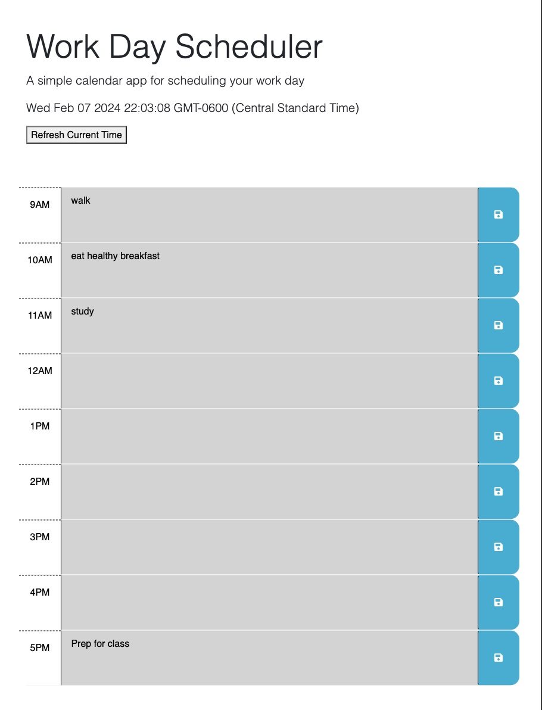
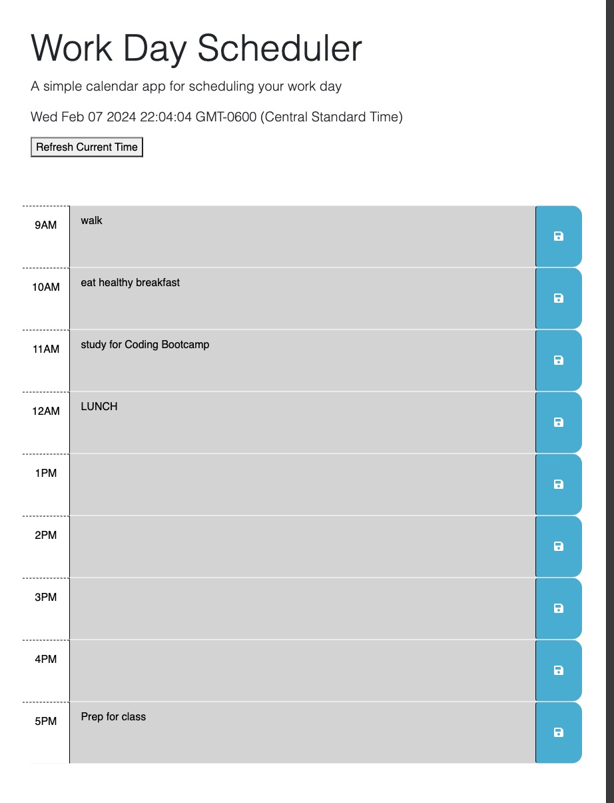

# my-Calendar-App
A calendar application for a work day scheduler.

## Description

User Story:
AS AN employee with a busy schedule
I WANT to add important events to a daily planner
SO THAT I can manage my time effectively

GitPages deployed link:
https://mbrown50.github.io/my-Calendar-App

GitHub Repo:
https://github.com/mbrown50/my-Calendar-App

## Installation

N/A

## Usage

N/A

## License

Please refer to the LICENSE in the repo.
MIT License

